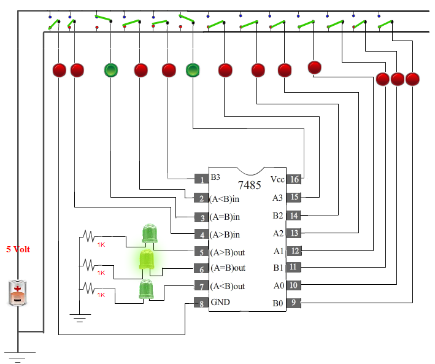
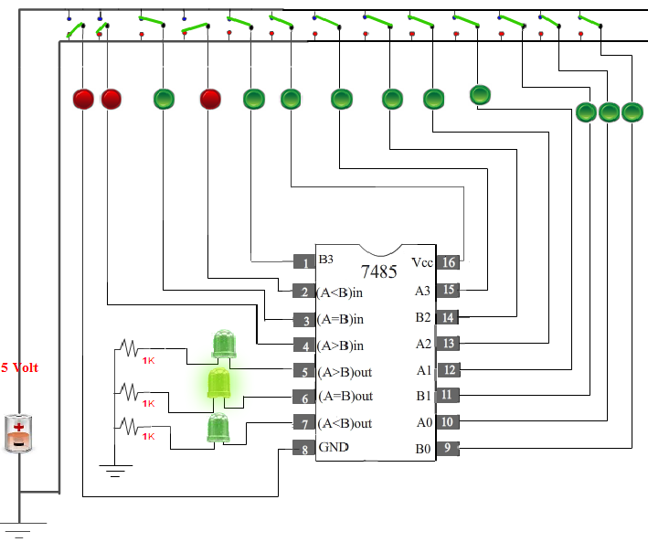

                            Procedure
                        

                            
                            

Please follow these steps to do the experiment.

                             
                             
                            
 <ul style="list-style:none">
                            
 
NOTE :
  <li class="expt1"> To perform this experiment,it is compulsary always to keep Vcc ON, GND OFF, (A = B)IN High, (A < B)IN Low and  (A > B)IN Low.
</li>
                            	
</ul>
                                 
                                
 
                                 
                               
 <ul style="list-style:none">
                            
                            
                         
<ul style="list-style:none">
                            
 <li class="expt1">	1.&nbsp;At first go through the structure of 7485.Then apply  high level voltage to A3 and low level voltage to B3.
</li>
                            	
</ul>
                                 
                                

                                 
                               
 <ul style="list-style:none">
                            
 <li class="expt1">	2.&nbsp;Next, apply  high level voltage to B3 and low level voltage to A3.
                                
</li>
</ul>

  
                                
  
                                 
                            	 <ul style="list-style:none">
                            
 <li class="expt1">	3.&nbsp;Next,  apply  high level voltage to A2 and low level voltage to B2 and keep same voltage level to A3 & B3 (Either High or Low)
                                </li>
</ul>
 

                                 

                                
 <ul style="list-style:none">
                            
 <li class="expt1">	4.&nbsp;Next,  apply  high level voltage to B2 and low level voltage to A2 and keep same voltage level to A3 & B3 (Either High or Low)
</li>
</ul>
 
                                
   
                                    
                                
                                
<ul style="list-style:none">
                            
<li class="expt1">	5.&nbsp;Next,  apply  high level voltage to A1 and low level voltage to B1 and keep same voltage level to A3, B3, A2 and B2   (Either High or Low)
</li>
</ul>
 
                                
   
                                  
                                
                                
<ul style="list-style:none">
 <li class="expt1">	6.&nbsp;Next,  apply  high level voltage to B1 and low level voltage to A1 and keep same voltage level to A3, B3, A2 and B2   (Either High or Low)
</li>
</ul>
 
                                
   
                                  
                                
                                
<ul style="list-style:none">
     <li class="expt1">	7.&nbsp;Next,  apply  high level voltage to A0 and low level voltage to B0 and keep same voltage level to A3, B3, A2, B2 A1 and B1 (Either High or Low)
</li>
</ul>
 
                                
   
                                                                         
                        
                        
                        
   <ul style="list-style:none">
                            
<li class="expt1">	8.&nbsp;Next,   apply  high level voltage to B0 and low level voltage to A0 and keep same voltage level to A3, B3, A2, B2, A1 and B1 (Either High or Low)
</li>
</ul>
 
                                
   
                                   
                                
                                
                                 
  <ul style="list-style:none">
                            
 <li class="expt1">	9.&nbsp;Next, apply  Same level voltage to A0, B0, A3, B3, A2, B2, A1 and B1 (Either High or Low)
</ul>
 
                                
   
                                 
 

                            
  
Please follow these steps to do the experiment(Part-II)

 

 <ul style="list-style:none">
 
 <li class="expt1"> 1.&nbsp; At first click on the Browse Block button  
    2.&nbsp; Next, drag the comparator block and drop it onto the bread board.
    </ul>    
     
    </li>                      
   
                                 
                                
                                 
                                 
                                
                                 
                                 
         <ul style="list-style:none">
  <li class="expt1"> 3.&nbsp;  Next, drag the Bus block and drop it onto the bread board.  
    
 </ul>    
     
    </li>                      
  
   
                                
                                 
                                 
                                
                                 
                                  
                                                       
<ul style="list-style:none">
 
 <li class="expt1"> 4.&nbsp;  Next, drag the output block and drop it onto the bread board.  
    
</ul>    
     
    </li>                      
   
 
                                
                                 
                                 
                                
                                  
                                 
                                 <ul style="list-style:none">
 
<li class="expt1"> 5.&nbsp;  Next, make a connection from switch A to B3 of the 1st comparator..  
    
 </ul>    
     
    </li>                      
   
   
                                
                                 
                                 
                                
                                  
                                 
                                 <ul style="list-style:none">
    <li class="expt1"> 5.&nbsp;  Next, make a connection from (A > B)out of the 1st comparator to (A < B)in of the 2nd oparator..  
    
</ul>    
     
    </li>                      
   
  
                                
                                 
                                 
                                
                                  
                                 
                                
                                 
                                 
                              <ul style="list-style:none">
    <li class="expt1"> 6.&nbsp;  Next, make a connection from (A > B)out of 2nd comparator to 1st LED...  
    
 </ul>    
     
    </li>                      
   
  
                                
                                 
                                    
                                
                                 
                                   
                                
                                 
                                    
                                
                                 
                                    
                                
                                 
                                   
                                  <ul style="list-style:none">
    <li class="expt1"> 7.&nbsp;  Overall connection...  
    
</ul>    
     
    </li>                      
   
  
                                
                                 
                                  
                                 <ul style="list-style:none">
    <li class="expt1"> 8.&nbsp;  Switch on the Vcc of the 1st & 2nd comparator..  
    
</ul>    
     
    </li>                      
   
  
                                
                                 
                                  
                                 <ul style="list-style:none">
    <li class="expt1"> 9.&nbsp;  Switch on the Vcc of the 1st & 2nd comparator & switch on the A3 of 2nd comparator..  
    
 </ul>    
     
    </li>                      
   
 
                                
                                 
                                  
                                   <ul style="list-style:none">
    <li class="expt1"> 9.&nbsp;  Switch on the Vcc of the 1st & 2nd comparator & switch on the B3 of 2nd comparator..  
    
 </ul>    
     
    </li>                      
   
 
                                
                                 
                                 
                                <ul style="list-style:none">
    <li class="expt1"> 10.&nbsp;  Switch on the Vcc of the 1st & 2nd comparator & switch on the A2 of 2nd comparator..  
    
</ul>    
     
    </li>                      
   
   
                                
                                 
                                  
                                <ul style="list-style:none">
    <li class="expt1"> 11.&nbsp;  Switch on the Vcc of the 1st & 2nd comparator & switch on the B2 of 2nd comparator..  
    
</ul>    
     
    </li>                      
   
 
                                
                                 
                                  
                                 <ul style="list-style:none">
    <li class="expt1"> 12.&nbsp;  Switch on the Vcc of the 1st & 2nd comparator & switch on the A1 of 2nd comparator..  
    
 </ul>    
     
    </li>                      
   
 
                                
                                 
                                  
                                 <ul style="list-style:none">
    <li class="expt1"> 13.&nbsp;  Switch on the Vcc of the 1st & 2nd comparator & switch on the B1 of 2nd comparator..  
    
 </ul>    
     
    </li>                      
   
   
                                
                                 
                                   
                                <ul style="list-style:none">
    <li class="expt1"> 14.&nbsp;  Switch on the Vcc of the 1st & 2nd comparator & switch on the A0 of 2nd comparator..  
    
</ul>    
     
    </li>                      
   
  
                                
                                 
                                  
                                <ul style="list-style:none">
    <li class="expt1"> 15.&nbsp;  Switch on the Vcc of the 1st & 2nd comparator & switch on the B0 of 2nd comparator..  
    
</ul>    
     
    </li>                      
   
  
                                
                                 
                                  
                                <ul style="list-style:none">
    <li class="expt1"> 16.&nbsp;  Switch on the Vcc of the 1st & 2nd comparator & switch on the A3 of 1st comparator..  
    
</ul>    
     
    </li>                      
   
 
                                
                                 
                                 
                                 <ul style="list-style:none">
    <li class="expt1"> 17.&nbsp;  Switch on the Vcc of the 1st & 2nd comparator & switch on the B3 of 1st comparator..  
    
 </ul>    
     
    </li>                      
   
   
                                
                                 
                                   
                                 <ul style="list-style:none">
    <li class="expt1"> 18.&nbsp;  Switch on the Vcc of the 1st & 2nd comparator & switch on the A2 of 1st comparator..  
    
 </ul>    
     
    </li>                      
   
  
                                
                                 
                                  
                                 <ul style="list-style:none">
    <li class="expt1"> 19.&nbsp;  Switch on the Vcc of the 1st & 2nd comparator & switch on the B2 of 1st comparator..  
    
 </ul>    
     
    </li>                      
   
 
                                
                                 
                                                                         <ul style="list-style:none">
    <li class="expt1"> 20.&nbsp;  Switch on the Vcc of the 1st & 2nd comparator & switch on the A1 of 1st comparator..  
    
 </ul>    
     
    </li>                      
   
  
                                
                                 
                                    
                                 <ul style="list-style:none">
    <li class="expt1"> 21.&nbsp;  Switch on the Vcc of the 1st & 2nd comparator & switch on the B1 of 1st comparator..  
    
 </ul>    
     
    </li>                      
   
  
                                
                                 
                                  
                                <ul style="list-style:none">
    <li class="expt1"> 22.&nbsp;  Switch on the Vcc of the 1st & 2nd comparator & switch on the A0 of 1st comparator..  
    
 </ul>    
     
    </li>                      
   
  
                                
                                 
                                  
                                 <ul style="list-style:none">
    <li class="expt1"> 23.&nbsp;  Switch on the Vcc of the 1st & 2nd comparator & switch on the B0 of 1st comparator..  
    
</ul>    
     
    </li>                      
   
 
                                
                                 
                                                             
                        
