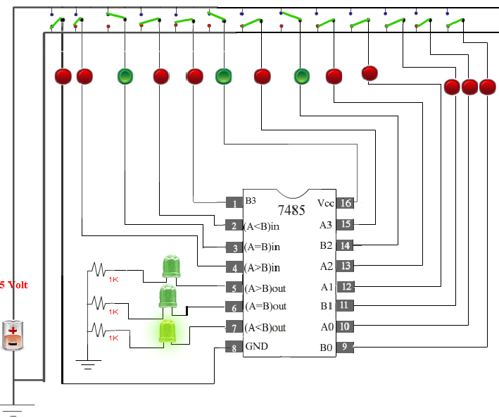
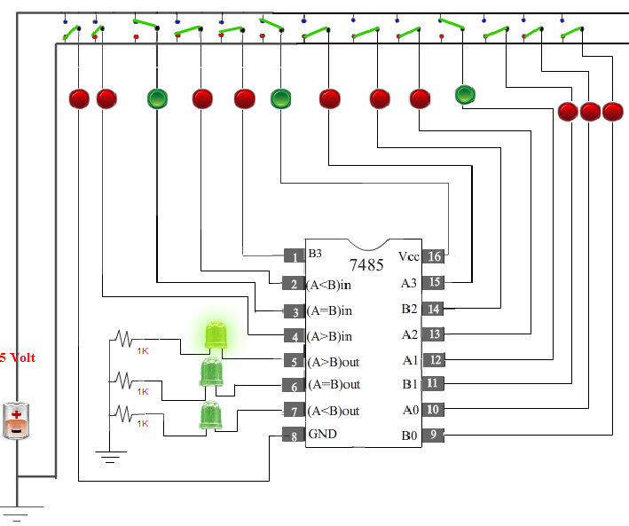

## Procedure

#### Please follow these steps to do the experiment.

### NOTE :
To perform this experiment,it is compulsary always to keep Vcc ON, GND OFF, (A = B)IN High, (A < B)IN Low and  (A > B)IN Low.

                              
1. At first go through the structure of 7485.Then apply  high level voltage to A3 and low level voltage to B3.

               
2. Next, apply  high level voltage to B3 and low level voltage to A3.
                                

                               
3. Next,  apply  high level voltage to A2 and low level voltage to B2 and keep same voltage level to A3 & B3 (Either High or Low)
                                

                                
4. Next,  apply  high level voltage to B2 and low level voltage to A2 and keep same voltage level to A3 & B3 (Either High or Low)

                               
5. Next,  apply  high level voltage to A1 and low level voltage to B1 and keep same voltage level to A3, B3, A2 and B2   (Either High or Low)

                                
6. ext,  apply  high level voltage to B1 and low level voltage to A1 and keep same voltage level to A3, B3, A2 and B2   (Either High or Low)

                               
7. Next,  apply  high level voltage to A0 and low level voltage to B0 and keep same voltage level to A3, B3, A2, B2 A1 and B1 (Either High or Low)

                                
8. Next,   apply  high level voltage to B0 and low level voltage to A0 and keep same voltage level to A3, B3, A2, B2, A1 and B1 (Either High or Low)

                                
9. ext, apply  Same level voltage to A0, B0, A3, B3, A2, B2, A1 and B1 (Either High or Low)

                                
