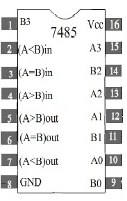
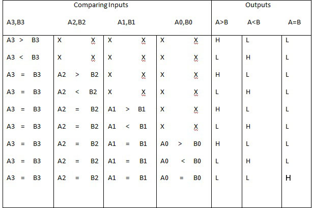
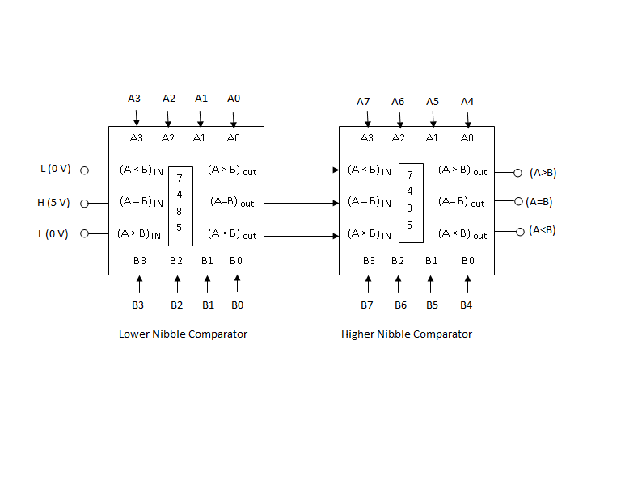

### Theory

                            
                            

             IC 7485 is used to compare magnitude of two binary numbers .The two 4-bit numbers are applied at the inputs A3,A2,A1,A0 and B3,B2,B1,B0 Where A3 and B3 are the most significant bits of the two 4-bit operands to be Compared.The Three cascading inputs (A = B)IN,(A < B)IN and (A > B)IN should be connected to logic '1'(HIGH),logic '0'(LOW) and logic '0'(LOW) respectively.The Three outputs (A > B)OUT,(A = B)OUT and (A < B)OUT will reflect the results of comparing the two 4-Bit numbers A=A3A2A1A0 and B=B3B2B1B0.
              
                            

                             
                             
                            Figure 1
                              
                              
                             

    
          The students of virtual DEC Laboratory can verify the functionality of the 7485 chip fully rather than testing for a total of 28=256 inputs,the students can observe the outputs listed in the compressed function table given below. 
  
          
 
                            

                             
                             
                            Figure 2
                             
                             
                            
 Part II 

                             

  Implement an 8-bit magnitude comparator using two 7485 chips.Let A= A7...A0 and B= B7...B0 be the two 8-bit numbers.Note that no external gates are required.  The three outputs of the 7485 comparing the lower nibbles , viz (A > B)OUT,(A = B)OUT and (A < B)OUT  are connected to the corresponding cascading inputs of the 7485 used to compare the higher nibbles.Final results of comparison are obtained at the(A > B)OUT,(A = B)OUT and (A < B)OUT terminals the higher nibble comparator.
   
                            

                            
                            
                            
                        

                    </section>